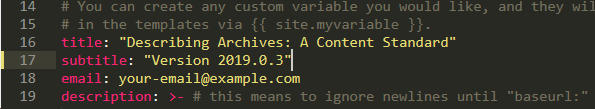
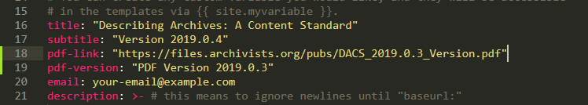

# saa-ts-dacs.github.io
This is the repository for the website displaying the latest version of DACS, available at https://saa-ts-dacs.github.io. This repo includes the Jekyll config, layouts, css, and other files required for building the website.

You may instead be looking for the repository that holds the content of DACS, available here: https://github.com/saa-ts-dacs/dacs.


## Getting Started

This will show you how to clone and build the site locally.

#### Clone the repo

Use the `--recurse-submodules` option to include the DACS repo.

```
git clone --recurse-submodules https://github.com/saa-ts-dacs/saa-ts-dacs.github.io
cd saa-ts-dacs.github.io
```

#### Prerequisites

Github Pages automatically builds the site from the content in the DACS repo as well as the Jekyll config, layouts and assets in this repo. So, while you don't need anything except git to make changes to the site, you will need Jekyll to build and test locally.

* git
* ruby
* Jekyll

##### macOS/Linux

For macOS/Linux, you should consider using [rvm](https://rvm.io/rvm/install) to manage multiple projects, but this is the easiest method:

```
gem install jekyll, bundler
bundle install
```

##### Windows

It is more difficult to setup Jekyll on Windows. The [Jekyll docs](https://jekyllrb.com/docs/installation/windows/) detail how to install Jekyll with both RubyInstaller and the Windows Subsystem for Linux.

#### Building the site

Once Jekyll is installed, all you have to do is 

```
jekyll serve
```

and navigate to http://localhost:4000


## Deployment

Once changes are made, all you have to do is commit the changes to the master branch to update https://saa-ts-dacs.github.io.

```
git add .
git commit -m "I changed these things!"
git push origin master
```


## Updating to New Versions of DACS

1. Make sure you have a clone of this repo using the `--recurse-submodules` option

```
git clone --recurse-submodules https://github.com/saa-ts-dacs/saa-ts-dacs.github.io
cd saa-ts-dacs.github.io
```

2. If you are not working in a fresh clone, pull the latest updates from the DACS repo

```
git pull --recurse-submodules
git submodule update --remote --recursive
```

3. Update the version number as the `subtitle` option in the `_config.yml` file



4. (Optional) If you were able to install the dependencies, it's a good idea to test the site locally.

```
jekyll serve
```
* Navigate to http://localhost:4000
* Ctrl + C to stop

5. Push updates back to the master branch

```
git add .
git commit -m "Updated DACS to version 2019.0.3"
git push origin master
```

## Updating link to PDF version

* The PDF URL and version number are listed in `_config.yml`
* Update them here when building the site




## Contributing

The site is maintained by the [Technical Subcommittee on Describing Archives: A Content Standard (DACS)](https://www2.archivists.org/groups/technical-subcommittee-on-describing-archives-a-content-standard-dacs), but pull requests to improve the site are welcome.

